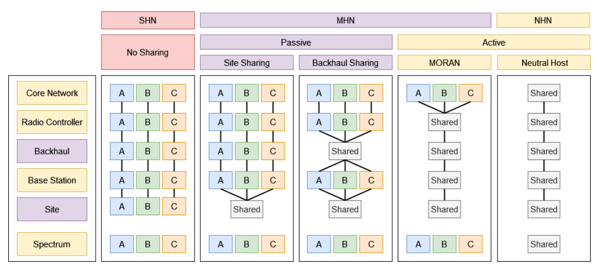

# This space is reserved for the 5G Study for UFSC.

## Infrastructure Sharing Models 

NS - No Sharing
PSS - Passive Site Sharing
PBS - Passive Backhaul Sharing
MORAN - Multi-Operator Radio Access Network (Active Sharing)
SHN - Single Host Network
MHN - Multiple Host Network
NHN - Neutral Host Network

